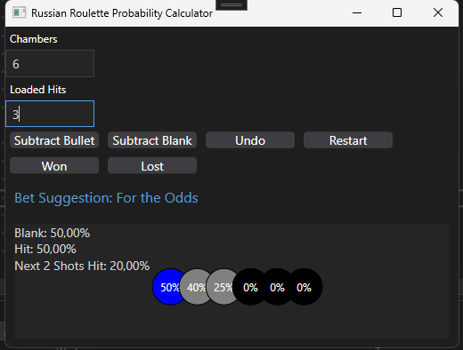

# Buckshot Roulette AI Helper

A WPF desktop application built with .NET 8 that assists players of **Buckshot Roulette** by tracking shell probabilities and providing AI-powered bet suggestions through a neural network trained on previous game outcomes.



## Features

- **Real-time probability tracking** – Displays the current chance of hitting a live round or a blank for each remaining chamber.
- **Chamber visualizer** – Colour-coded circles represent each chamber: red (likely live), grey (likely blank), and blue (50 / 50).
- **AI bet suggestion** – A small neural network (Accord.NET) learns from your game history and recommends whether to bet *for* or *against* the odds.
- **Undo support** – Revert the last action (bullet or blank subtraction) in one click.
- **Game logging** – Every round, result (Won / Lost), and game-start event is appended to `RussianRouletteLog.txt` to build up the training dataset over time.
- **Fluent UI design** – Modern dark-mode interface powered by [ModernWpf](https://github.com/Kinnara/ModernWpf).

## Requirements

| Requirement | Version |
|---|---|
| .NET SDK | 8.0 or newer |
| Operating System | Windows 10 / 11 |
| Visual Studio | 2022 (recommended) |

## Getting Started

### Clone & Open

```bash
git clone https://github.com/zenoxart/BuckshotRouletteAIHelper.git
cd BuckshotRouletteAIHelper/BuckshotRouletteHelper
```

Open `BuckshotRouletteHelper.sln` in Visual Studio 2022 (or run `dotnet restore` from the command line).

### Build & Run

**Visual Studio:** Press <kbd>F5</kbd> or select *Debug → Start Debugging*.

**Command line (Windows):**

```bash
dotnet run --project BuckshotRouletteHelper/BuckshotRouletteHelper.csproj
```

## Usage

1. Enter the total number of **Chambers** and the number of **Loaded Hits** (live rounds) at the start of each round.
2. After each shot:
   - Click **Subtract Bullet** if the shot was a live round.
   - Click **Subtract Blank** if the shot was a blank.
3. The probability display and chamber visualiser update automatically.
4. Click **Won** or **Lost** after the game ends to record the outcome for AI training.
5. Click **Restart** to reset the counters and start a new game.
6. Use **Undo** to revert the last subtraction if you made a mistake.

## Project Structure

```
BuckshotRouletteHelper/
├── BuckshotRouletteHelper.sln
└── BuckshotRouletteHelper/
    ├── App.xaml                    # Application entry point & ModernWpf theme
    ├── App.xaml.cs
    ├── MainWindow.xaml             # Fluent UI main window
    ├── MainWindow.xaml.cs          # UI logic & probability calculations
    ├── NeuralNetworkAnalyser.cs    # Accord.NET neural network wrapper
    └── BuckshotRouletteHelper.csproj
```

## NuGet Dependencies

| Package | Purpose |
|---|---|
| `Accord` | Base framework |
| `Accord.MachineLearning` | Machine learning utilities |
| `Accord.Neuro` | Neural network (backpropagation) |
| `Accord.Statistics` | Statistical helpers |
| `ModernWpf.WPF` | Fluent UI / WinUI-style controls for WPF |

## License

This project is provided as-is for educational and hobby purposes.
